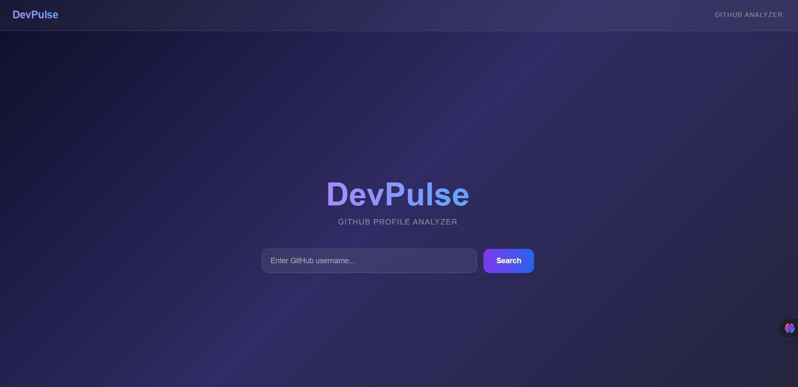
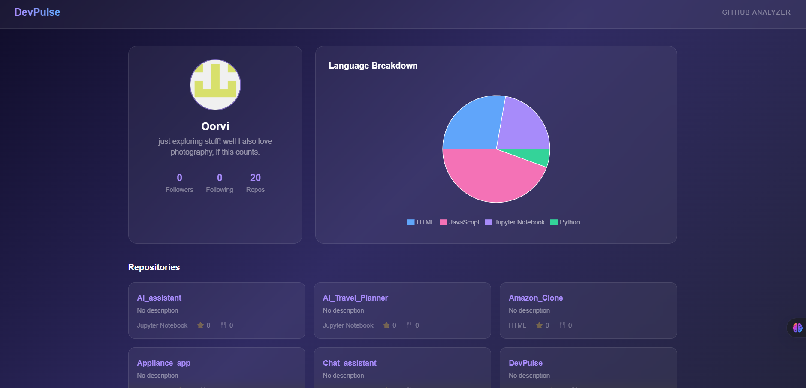

# DevPulse 🚀

A GitHub Profile Analyzer built with React that fetches and visualizes any GitHub user's profile data, repositories, and language breakdown in real time.

🔗 **Live Demo**: [dev-pulse-ten.vercel.app](https://dev-pulse-ten.vercel.app/)

---

## Features

- 🔍 Search any GitHub username instantly
- 👤 View profile stats — followers, following, public repos
- 📁 Browse all public repositories with stars, forks and language
- 📊 Interactive pie chart showing language breakdown
- ⚡ Loading and error states for smooth UX
- 🎨 Glassmorphism UI with purple-blue gradient theme

---

## Tech Stack

- **React** — UI framework
- **React Router** — client-side routing
- **Recharts** — data visualization
- **Tailwind CSS** — styling
- **GitHub REST API** — data source
- **Vite** — build tool
- **Vercel** — deployment

---

## Getting Started

### Prerequisites
- Node.js v18+
- npm

### Installation

```bash
# Clone the repository
git clone https://github.com/yourusername/DevPulse.git

# Navigate into the project
cd DevPulse

# Install dependencies
npm install

# Start the development server
npm run dev
```

Open [http://localhost:5173](http://localhost:5173) in your browser.

---

## Project Structure

```
src/
├── pages/
│   ├── Home.jsx         # Search page
│   └── Profile.jsx      # Profile & data page
├── components/
│   ├── Navbar.jsx        # Top navigation
│   ├── ProfileCard.jsx   # User info card
│   ├── RepoCard.jsx      # Individual repo card
│   └── Charts.jsx        # Language pie chart
├── App.jsx               # Routes setup
├── main.jsx              # Entry point
└── index.css             # Global styles + Tailwind
```

---

## How It Works

1. User enters a GitHub username on the home page
2. App navigates to `/profile/:username`
3. Two API calls are made to the GitHub REST API — one for user data, one for repositories
4. Language breakdown is computed from the repos array and passed to Recharts
5. All data is displayed in a clean, responsive dashboard

---

## API Used

- `GET https://api.github.com/users/:username` — fetch user profile
- `GET https://api.github.com/users/:username/repos` — fetch repositories

No authentication required. Free and public.

---

## Deployment

Deployed on **Vercel** with zero configuration. Vite is auto-detected.

```bash
# Build for production
npm run build
```

---

## Screenshots




## Author

Made with 💙 by Oorvi Kulshreshtha
(https://github.com/oorrvii)